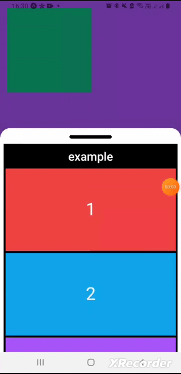

# SwipeUp Lib React-Native

SwipeUp Lib is a React Native library that provides an easy and flexible solution for adding swipe-up gestures to your mobile applications. With this library, developers can quickly implement the swipe-up functionality to trigger actions, reveal menus, or display additional information, enhancing the user experience.

## Usage

```bash
# Using npm
npm install react-native-tailwindcss

# Using Yarn
yarn add react-native-tailwindcss
```

## Features

- Customizable with Tailwind CSS

## Usage/Examples

```javascript
import { Text, TouchableOpacity, View } from "react-native";
import { SwipeUp } from "swipeup-lib-react-native";
import { Card } from "../card";

export default function Example() {
    return (
        <View className="flex-1 p-4 bg-purple-500">
            <TouchableOpacity className="w-48 h-48 bg-emerald-500"/>
            {/* <!-- This is an example of a swipeable card component --> */}
            <SwipeUp
                borderColor="bg-white"
                backgroundColor="bg-black"
                touchIconColor="bg-black"
            >
                <Text className="text-white font-semibold text-center my-2 text-2xl">
                    example
                </Text>
                <Card color="bg-red-500" text="1" />
                <Card color="bg-sky-500" text="2" />
                <Card color="bg-purple-500" text="3" />
                <Card color="bg-amber-500" text="4" />
            </SwipeUp>
        </View>
    );
}
```


## Demo




## Improvements

If you have made any improvements to the code, such as refactoring, performance enhancements, accessibility improvements, etc., please create an issue to discuss them.


## Support

For support, please send an email to brunogomesdsilva7@gmail.com.
